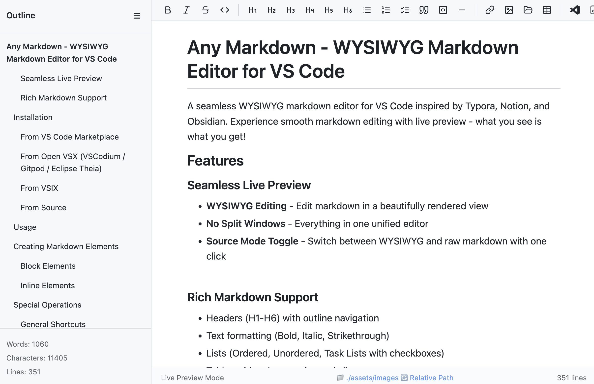
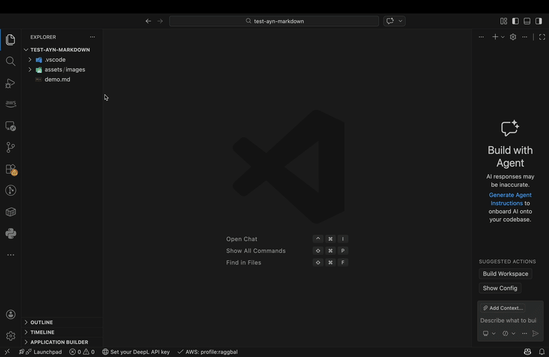
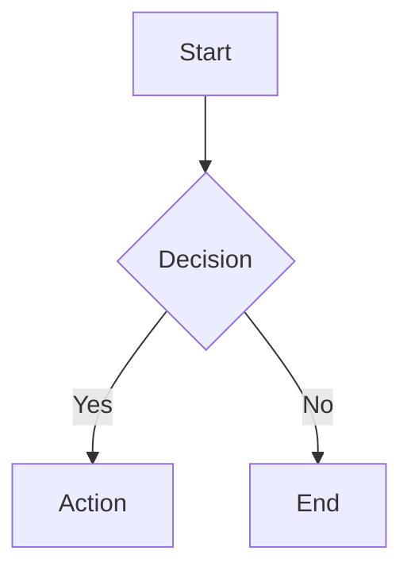

 Any Markdown - AI-Friendly WYSIWYG Markdown Editor for VS Code
=

A WYSIWYG markdown editor designed for the AI coding era. Edit markdown visually while AI assistants (Claude Code, Cursor, GitHub Copilot, etc.) modify the same file in real-time — your edits and AI's edits coexist safely. Inspired by Typora, Notion, and Obsidian.




## Demo (gif)

You can freely use markdown using only the keyboard.
lists, tables, code blocks, and everything else!And when you want to request AI Chat, select the range and press cmd+l (ctr+l).

## Features

### AI-Friendly Editing

**Edit markdown visually while AI modifies the same file — your edits and AI's edits coexist safely.**

- `Cmd+L`** / **`Ctrl+L` — Select text in the WYSIWYG editor, press `Cmd+L`, and the source file opens in VS Code's text editor with the exact lines selected (even within lists and tables). Press `Cmd+L` again to send to AI chat. Works with VS Code, Cursor, Kiro, and more.
- **Real-time external change sync** — When AI assistants modify the file, only changed blocks are patched via block-level DOM diff. Your cursor position and in-progress edits are preserved. No "file modified externally" dialogs.

---

### Seamless Live Preview
- **WYSIWYG Editing** - Edit markdown in a beautifully rendered view
- **No Split Windows** - Everything in one unified editor
- **Source Mode Toggle** - Switch between WYSIWYG and raw markdown with one click

### Rich Markdown Support
- Headers (H1-H6) with outline navigation
- Text formatting (Bold, Italic, Strikethrough)
- Lists (Ordered, Unordered, Task Lists with checkboxes)
- Tables with column resize and alignment
- Code blocks with syntax highlighting
- Blockquotes
- Horizontal rules
- Links and Images (drag & drop, paste support)
- Smart link creation — select text and paste a URL to create `[selected text](URL)`
- Mermaid diagrams
- KaTeX math equations
- YAML Front Matter


---

## Installation

### From VS Code Marketplace

1. Open VS Code
2. Go to Extensions (`Ctrl+Shift+X`)
3. Search for **"Any Markdown Editor"**
4. Click **Install**

Or install directly: [VS Code Marketplace](https://marketplace.visualstudio.com/items?itemName=imaken.any-markdown)

### From Open VSX (VSCodium / Gitpod / Eclipse Theia)

[Open VSX Registry](https://open-vsx.org/extension/imaken/any-markdown)

### From VSIX
```bash
code --install-extension any-markdown-{version}.vsix
```

### From Source
```bash
git clone https://github.com/raggbal/any-markdown
cd any-markdown
npm install
npm run compile
# Press F5 to launch in debug mode
```

---

## Set as Default Editor for Markdown Files

To always open `.md` files with Any Markdown Editor:

1. Right-click any `.md` file in the Explorer
2. Select **"Open With..."**
3. Select **"Configure default editor for '*.md'..."**
4. Select **"Any Markdown"**

---

## Usage

1. Open any `.md` or `.markdown` file
2. Right-click and select **"Open with Any Markdown Editor"**
3. Or use Command Palette: `Any Markdown: Open with Any Markdown Editor`

---

## Creating Markdown Elements

### Block Elements

| Element | Pattern Input | Toolbar | Shortcut |
| --- | --- | --- | --- |
| Heading 1 | `# ` + Space | Heading menu → H1 | `Ctrl+1` |
| Heading 2 | `## ` + Space | Heading menu → H2 | `Ctrl+2` |
| Heading 3 | `### ` + Space | Heading menu → H3 | `Ctrl+3` |
| Heading 4 | `#### ` + Space | Heading menu → H4 | `Ctrl+4` |
| Heading 5 | `##### ` + Space | Heading menu → H5 | `Ctrl+5` |
| Heading 6 | `###### ` + Space | Heading menu → H6 | `Ctrl+6` |
| Paragraph | (default)<br> | — | `Ctrl+0` |
| Unordered List | `- ` or `* ` + Space | List button | `Ctrl+Shift+U` |
| Ordered List | `1. ` + Space | Numbered list button | `Ctrl+Shift+O` |
| Task List | `- [ ] ` + Space | Task list button | `Ctrl+Shift+X` |
| Blockquote | `> ` + Space | Quote button | `Ctrl+Shift+Q` |
| Code Block | ````` ``` ````` + Enter | Code button | `Ctrl+Shift+K` |
| Table | `| col1 | col2 |` + Enter | Table button | `Ctrl+T` |
| Horizontal Rule | `---` + Enter | HR button | `Ctrl+Shift+-` |


### Inline Elements

| Element | Pattern Input | Toolbar | Shortcut |
| --- | --- | --- | --- |
| Bold | `**text**` + Space | Bold button | `Ctrl+B` |
| Italic | `*text*` + Space | Italic button | `Ctrl+I` |
| Strikethrough | `~~text~~` + Space | Strikethrough button | `Ctrl+Shift+S` |
| Inline Code | ``` `text` ``` + Space | Code button | ``` Ctrl+` ``` |
| Link | `[text](url)` <br>Space conversion not supported<br> | Link button | `Ctrl+K` |
| Image | `` <br>Space conversion not supported<br> | Image button | `Ctrl+Shift+I` |


---

## Special Operations

### General Shortcuts

| Shortcut | Action |
| --- | --- |
| `Ctrl/Cmd + S` | Save |
| `Ctrl/Cmd + Z` | Undo |
| `Ctrl/Cmd + Shift + Z` | Redo |
| `Ctrl/Cmd + B` | Bold |
| `Ctrl/Cmd + I` | Italic |
| `Ctrl/Cmd + K` | Insert link |
| `Ctrl/Cmd + F` | Find |
| `Ctrl/Cmd + H` | Find and replace |
| `Ctrl/Cmd + L` | Open source file with selected lines in text editor |

### Escaping Block Elements

| Element | Key | Action |
| --- | --- | --- |
| Code Block | `Shift+Enter` | Exit code block and create new paragraph |
| Blockquote | `Shift+Enter` | Exit blockquote and create new paragraph |
| Mermaid/Math | `Shift+Enter` | Exit block and create new paragraph |
| Code Block | `↑` at first line | Exit to previous element |
| Code Block | `↓` at last line | Exit to next element |
| Blockquote | `↑` at first line | Exit to previous element |
| Blockquote | `↓` at last line | Exit to next element |
| Mermaid/Math | `↑` at first line | Exit to previous element |
| Mermaid/Math | `↓` at last line | Exit to next element |

### Escaping Inline Elements

To exit inline formatting, type the closing marker followed by Space:

| Element | Input | Action |
| --- | --- | --- |
| Bold | `**` + Space | Close bold and move cursor outside |
| Italic | `*` + Space | Close italic and move cursor outside |
| Strikethrough | `~~` + Space | Close strikethrough and move cursor outside |
| Inline Code | ``` ` ``` + Space | Close inline code and move cursor outside |

### Table Operations

| Key | Action |
| --- | --- |
| `Tab` | Move to next cell |
| `Shift+Tab` | Move to previous cell |
| `Enter` | Insert new row |
| `Shift+Enter` | Insert line break within cell |
| `↑` / `↓` | Navigate between rows |
| `←` / `→` | Navigate within/between cells |
| `Cmd+A` | Select all text in current cell |

### Code Block Operations

| Key | Action |
| --- | --- |
| `Tab` | Insert 4 spaces |
| `Shift+Tab` | Remove up to 4 leading spaces |
| `Cmd+A` | Select all text within code block |

### List Operations

| Key | Action |
| --- | --- |
| `Tab` | Indent list item (increase nesting) |
| `Shift+Tab` | Outdent list item (decrease nesting) |
| `Enter` on empty item | Convert to paragraph or decrease nesting |
| `Backspace` at start | Convert to paragraph |
| Pattern at line start + Space | Convert list type in-place (e.g., `1. ` converts `- item` to ordered list) |

### Multi-Block Selection

| Key | Action |
| --- | --- |
| `Tab` | Insert 4 spaces at the beginning of each selected block |
| `Shift+Tab` | Remove up to 4 leading spaces from each selected block |

---

## Code Block Features

### Supported Languages

The editor supports syntax highlighting for the following languages:

`javascript`, `typescript`, `python`, `json`, `bash`, `shell`, `css`, `html`, `xml`, `sql`, `java`, `go`, `rust`, `yaml`, `markdown`, `c`, `cpp`, `csharp`, `php`, `ruby`, `swift`, `kotlin`, `dockerfile`, `plaintext`

**Language Aliases:** `js`→javascript, `ts`→typescript, `py`→python, `sh`→bash, `yml`→yaml, `md`→markdown, `c++`→cpp, `c#`→csharp

### Display Mode / Edit Mode

- **Display Mode**: Shows syntax-highlighted code with language tag and copy button
- **Edit Mode**: Plain text editing (click on code block to enter)
- **Expand Button**: Open code in a separate VS Code editor tab for larger editing

### Mermaid Diagrams

Code blocks with language `mermaid` are rendered as diagrams:



- Click on diagram to edit source
- Diagram re-renders when exiting edit mode

### KaTeX Math Equations

Code blocks with language `math` are rendered as mathematical equations using KaTeX:

```math
E = mc^2
\int_0^\infty e^{-x} dx = 1
\sum_{n=1}^{\infty} \frac{1}{n^2} = \frac{\pi^2}{6}
```

- Each line is rendered as an independent display-mode equation
- Click on the rendered equation to edit the LaTeX source
- Equations re-render automatically (500ms debounce) while editing
- Invalid LaTeX is shown as a red error message (does not break the layout)
- Empty blocks show "Empty expression"
- Navigate in/out with arrow keys, just like code blocks and Mermaid diagrams

---

## Image Path Configuration

Images can be saved to custom directories when pasting or drag-and-dropping.

### Configuration Levels

| Level | Setting File | Description |
| --- | --- | --- |
| **Global** | `~/Library/Application Support/Code/User/settings.json` (macOS)<br>`%APPDATA%\Code\User\settings.json` (Windows)<br>`~/.config/Code/User/settings.json` (Linux) | VS Code user settings |
| **Project** | `.vscode/settings.json` | Project-level override |
| **File** | Per-file directive | Per-file override in markdown footer |

### VS Code settings.json Setting

```json
{
  "any-markdown.imageDefaultDir": "./images",
  "any-markdown.forceRelativeImagePath": true
}
```

### Per-File Directive

Add at the end of your markdown file:

```markdown
---
IMAGE_DIR: ./assets/images
FORCE_RELATIVE_PATH: true
```

### Path Behavior Matrix

`forceRelativeImagePath` allows you to separate the **image save location** from the **path written in Markdown**.

**Use case**: When you want to save images to a specific absolute path (e.g., `/Users/shared/images/`) but reference them using relative paths from the Markdown file, set this to `true`.

> **Note**: `forceRelativeImagePath` only takes effect when `imageDefaultDir` is an absolute path. When using relative paths, the setting is ignored as paths are always relative.

| imageDefaultDir | forceRelativeImagePath | Image Save Location | Path in Markdown |
| --- | --- | --- | --- |
| Absolute (e.g., `/Users/shared/images`) | `false` (default) | Specified absolute path | Absolute path |
| Absolute (e.g., `/Users/shared/images`) | `true` | Specified absolute path | Relative path from Markdown file |
| Relative (e.g., `./images`) | `false` | Relative to Markdown file | Relative path |
| Relative (e.g., `./images`) | `true` | Relative to Markdown file | Relative path (setting ignored) |

---

## Configuration

### VS Code Settings

| Setting | Description | Default |
| --- | --- | --- |
| `any-markdown.theme` | Editor theme (`github`, `sepia`, `night`, `dark`, `minimal`, `perplexity`) | `github` |
| `any-markdown.fontSize` | Base font size (px) | `16` |
| `any-markdown.imageDefaultDir` | Default directory for saved images | `""` (same as markdown file) |
| `any-markdown.forceRelativeImagePath` | Force relative paths for images | `false` |
| `any-markdown.language` | UI language (`default`, `en`, `ja`, `zh-cn`, `zh-tw`, `ko`, `es`, `fr`) | `default` |
| `any-markdown.enableDebugLogging` | Enable debug logging in browser console | `false` |

### Themes

| Theme | Description |
| --- | --- |
| `github` | Clean GitHub-style rendering (default) |
| `sepia` | Warm, paper-like appearance for comfortable reading |
| `night` | Dark theme with Tokyo Night inspired colors (blue tint) |
| `dark` | Pure dark theme with neutral black/gray colors |
| `minimal` | Distraction-free black and white design |
| `perplexity` | Light theme with Perplexity brand colors (Paper White background) |

---

## Supported Languages (i18n)

The editor UI supports the following languages:

| Language | Code |
| --- | --- |
| English | `en` (default) |
| Japanese | `ja` |
| Simplified Chinese | `zh-cn` |
| Traditional Chinese | `zh-tw` |
| Korean | `ko` |
| Spanish | `es` |
| French | `fr` |

Set via `any-markdown.language` or use `default` to follow VS Code's display language.

---

## Commands

Available in Command Palette (`Ctrl+Shift+P` / `Cmd+Shift+P`):

| Command | Description |
| --- | --- |
| `Any MD: Open with Any Markdown Editor` | Open markdown file in WYSIWYG editor |
| `Any MD: Insert Table` | Insert a new table |
| `Any MD: Insert TOC` | Insert table of contents |
| `Any MD: Open as Text` | Open in standard text editor |
| `Any MD: Compare as Text` | Compare with text version |
| `Any MD: Toggle Source Mode` | Switch between WYSIWYG and source mode |
| `Any MD: Undo` | Undo last edit |
| `Any MD: Redo` | Redo last undone edit |

### Keyboard Shortcuts

These shortcuts are active only when the Any Markdown editor is focused:

| Shortcut (Mac / Win) | Action |
| --- | --- |
| `Cmd+/` / `Ctrl+/` | Toggle Source Mode |
| `Cmd+.` / `Ctrl+.` | Open in Text Editor |
| `Cmd+Z` / `Ctrl+Z` | Undo |
| `Cmd+Shift+Z` / `Ctrl+Shift+Z` | Redo |

---

## External File Changes

When another tool (e.g., AI coding assistants like Claude Code, Cursor, etc.) modifies the same markdown file while you have it open in Any Markdown:

- **Block-level DOM diff**: Only changed blocks are updated — your cursor position and in-progress edits are preserved.
- **Toast notification**: A notification appears allowing you to review and accept or dismiss external changes.
- **Unsaved changes warning**: If you have unsaved edits, a confirmation dialog prevents accidental overwrites.

---

## Development

```bash
# Install dependencies
npm install

# Compile TypeScript
npm run compile

# Watch for changes
npm run watch

# Run tests
npm test

# Package extension
vsce package --no-dependencies
```

---

## Support This Project

If you find this extension useful, please consider:

- [**Sponsor** on GitHub](https://github.com/sponsors/raggbal) - Help keep this project maintained
- **Star** this repository on [GitHub](https://github.com/raggbal/any-markdown)
- **Report issues** or suggest features on [Issues](https://github.com/raggbal/any-markdown/issues)
- **Contribute** with pull requests

Your support helps keep this project maintained and improved!

---

## License

MIT License - feel free to use this extension in your projects.

---

## Acknowledgments

- Inspired by [Typora](https://typora.io/), [Notion](https://notion.so/), and [Obsidian](https://obsidian.md/)
- Built with love for the VS Code community

---
IMAGE_DIR: ./assets/images
FORCE_RELATIVE_PATH: true